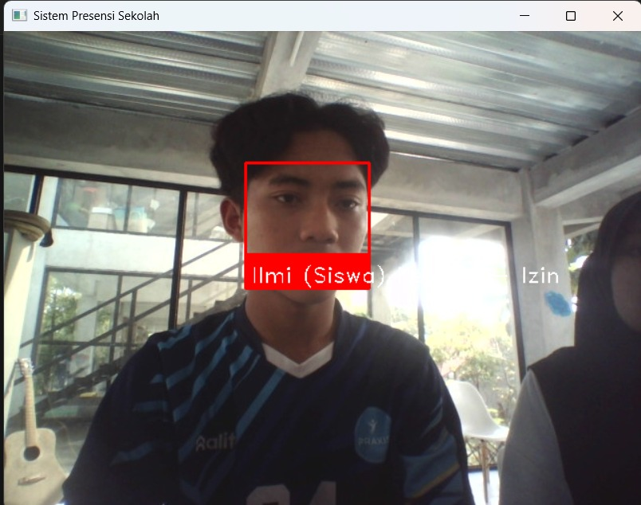

# Project School Attendance
School attendance adalah proyek sistem absensi yang dirancang untuk mempermudah proses pencatatan kehadiran siswa di sekolah secara otomatis. Sistem ini mampu mengenali wajah siswa secara real time melalui kamera dan mencocokkan dengan data yang telah terdaftar dan mencatatnya.

**Cara Instalasi**
1. cv2 or opencv: pip install opencv-python
2. face_recognition:
    - install cmake (wajib untuk kompilasi dlib): pip install cmake
    - install dlib (library machine learning): pip install dlib
    - pip install face_recognition 
3. os: import os
4. numpy: pip install numpy
5. json: modul json sudah termasuk bawaan Python
6. tkinter: modul tkinter sudah termasuk bawaan Python
7. pyttsx3: pip install pyttsx3
    di beberapa kasus memerlukan pyaudio: pip install pyaudio

**Cara Verifikasi Instalasi**
1. cv2 or opencv: 

    import cv2
    
    print(cv2.__version__)  # Cetak versi OpenCV

2. face_recognition: 

    import face_recognition
    
    print(face_recognition.__version__)  # akan mencetak versi

3. tkinter:

    python -m tkinter

4. pyttsx3;

    import pyttsx3

    engine = pyttsx3.init()

    engine.say("Halo, pyttsx3 berhasil diinstal")

    engine.runAndWait()

**Library yang Digunakan**
1. cv2 or opencv: untuk capture kamera dan memproses gambar
2. face recognition: untuk deteksi dan pengenalan wajah
3. cmake
4. dlib
5. os: manajement hardware (mengontrol CPU, RAM, storage, dan perangkat input/output), manajemen file (mengatur penyimpanan data), dan manajement aplikasi (menjalankan dan menghentikan program)
6. numpy: untuk komputasi saintifik dan analisis data
7. json: untuk penyimpanan data
8. tkinter: untuk membuat GUI (graphical user interface) berbasis desktop
9. pyttsx3: memungkinkan program untuk berbicara (text-to-speech) dengan suara sintesis

**Cara Kerja School Attendance**
1. Import Library: Mengimpor semua modul yang dibutuhkan seperti yang sudah di cantumkan di atas.

2. Membuat folder penyimpanan data wajah yang terdaftar dan hasil deteksi

4. Inisialisasi text-to-speech: Menyiapkan sistem suara untuk menyapa pengguna

5. Mengaktifkan kamera dan memproses untuk mendeteksi wajah secara langsung menggunakan start_video_stream()

6. Membaca dan mengambil gambar setiap frame dari webcam

7. Supaya wajah lebih mudah dikenali sistem akan meningkatkan pencahayaan pada gambar menggunakan improve_lighting(image)

8. Mendeteksi wajah dan menghitung encodingnya 

9. Mengenali dan membandingkan wajah yang terdeteksi dengan data yang sudah tersimpan dan memberikan nama serta peran yang sesuai dengan wajah menggunakan check_known_face

10. Jika wajah dikenal saat pertama kali hadir maka sistem akan menyimpan waktu kedatangan, berikan ucapan selamat datang dan menyimoan foto wajah

11. Jika wajahdikenal setekah jam 15.00 maka sistem akan menyimpan waktu pulang, memberikan ucapan selamat jalan dan menyimpan foto wajah

12. Jika wajah tidak bisa dikenali maka siste akan menampilkan label press s untuk registrasi

13. Layar akan menampilkan kotak yang bertuliskan nama pemilik wajah tersebut

14. Untuk registrasi wajah baru maka setelah menekan s maka akan menampilkan dialog untuk imput nama dan peran serta menyimpan wajah yang terdeteksi

15. Untuk keluar dari program tekan q maka akan menutup kamera dan jendela video

16. Jalankan start_video_stram() untuk memulai proses seperti sebelumnya

**Guide Penggunaan untuk User**
1. Pastikan wajah kamu terlihat jelas di depan kamera

2. Jika wajahmu sudah terdaftar: kamera akan otomatis mengenali wajahmu dan akan mendengar suara "Selamat datang, [Nama]" maka kamu sudah terabsen hadir.

3. Jika wajahmu belum terdaftar: Layar akan menunjukkan press S to register. Kamu akan diminta untuk menuliskan nama lengkap dan peran. Setelah terdaftar maka wajahmu dapat dikenali secara otomatis saat absensi berikutnya.

4. Setelah jam 15.00, ulangi menghadap kamera, setelah kamera mengenali dan menyapa "Selamat Jalan [Nama]" maka kamu sudah terabsen pulang.
